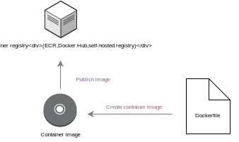

#What is Amazon EC2 Container Service?

Amazon EC2 Container Service(Amazon ECS) はEC2からなるクラスタ上でDockerコンテナを運用するにあたって、簡単に起動、停止が出来、また速さや高い拡張性をもつサービス。

あなたクラスタ上のコンテナを可用性の要件や独立性にしたがって計画的に配置するできる。Amazon ECSはインフラのスケーリングの運用の心配や、クラスタのオペレーションや運用を取り除いてくれる。

Amazon ECSは、管理とスケールバッチとExtracet-Transform-Load(ETL)ワークロードやマイクロサービスモデルの洗練されたアプリケーション設計の構築を一貫としたデプロイメントとbuildで実現し利用できる。より詳細なECSの使用例とシナリオは[Container Use Cases](https://aws.amazon.com/containers/use-cases/)を参照。
 
AWS Elastic Beanstalk もあなたのアプリケーションのインフラの他のコンポーネントと連動してDockerコンテナの速い開発、テスト、とデプロイを行うことが出来る。しかしながら、Amazon ECSはより直接に粒度の高いコントロールと対応を提供する。Beanstalkについては[AWS Elastic Beanstalk Developer Guide](http://docs.aws.amazon.com/elasticbeanstalk/latest/dg/)を参照。

##Features of Amazon ECS

Amazon ECS は一つのリージョン内のマルチAZにわたる高い可用手法のアプリケーションコンテナを起動するために簡素化したリージョン依存のサービス。すでにあるVPC、また新しいVPCをにECSを作ることが出来る。特定のDockerimageから作られたクラスタを起動した後にtask definitionsとサービスを設定することが出来る。コンテナイメージはAWS環境内や外のコンテナリポジトリに保存やpullする。


次のセクションではAmazon ECS アーキテクチャの個々の要素により詳細に触れていく。

###Containers and Images
Amazon ECSにアプリケーションをデプロイする場合、アプリケーションコンポーネントはコンテナで動かせるように構成する必要がある。Docker コンテナはソフトウェア開発において標準化されたユニットで、アプリケーションを動かすに必要なソフトウェア、コード、ランタイム、システムツール、ライブラリー等すべて含まれている。コンテナはイメージと呼ばれるリードオンリーなテンプレートから作られる。

コンテナイメージは一般的にDockerfileから作られる。Dockerfileはコンテナに含まれるすべてのコンポーネントが記述されているplan textファイルである。レジストリーに保存されたコンテナイメージをダウンロードし、コンテナインスタンス上で動かすことが出来る。より詳細な情報は[Docker Basics](http://docs.aws.amazon.com/AmazonECS/latest/developerguide/docker-basics.html)を参照。



###Task Definitions
Amazon ECS上にアプリケーションを動かすために*task definition*を作る。task definitionはjsonフォーマットのテキストファイルでアプリケーションの形を一つ以上記述する。それはアプリケーションの設計図として考える事ができる。Task definitionsは様々のパラメータを設定できる。例えば、どのリポジトリにあるコンテナを使用するか、どのポートをコンテナインスタンスに開けるか、コンテナはどのdata volumeを使用すべきかなど。より詳しい内容は[Amazon ECS Task Definitions](http://docs.aws.amazon.com/AmazonECS/latest/developerguide/task_defintions.html)を参照。

下記は簡単なtask definitionの例である。Nginxのwebサーバコンテナが一つあるもの。より拡張された複数のコンテナを使った例は[Example Task Definitions](http://docs.aws.amazon.com/AmazonECS/latest/developerguide/example_task_definitions.html)を参照。 

```json
{
      "family": "webserver",
      "containerDefinitions": [
      {
              "name": "web",
              "image": "nginx",
              "cpu": 99,
              "memory": 100,
              "portMappings": [{
                      "containerPort": 80,
                      "hostPort": 80
              }]
      }
} 
```
###Tasks and Scheduling

taskとはクラスタ内にあるコンテナインスタンス上のtask definitionの実体化したものある。Amazon ECSにアプリのtask definitionを作れば、クラスタに起動できるタスクの数を設定できる。

Amazon ECS taskスケジューラーはコンテナインスタンスにタスク配置することを受け持つ。いくつか異なるスケジューリングオプションを利用できる。例えば、指定した数のtaskを同時に起動やメンテンナスをするよう定義できる。異なるスケジューリングオプションについては[Scheduling Amazon ECS Tasks](http://docs.aws.amazon.com/AmazonECS/latest/developerguide/scheduling_tasks.html)を参照。


###Clusters
Amazon ECSはEC2インスタンスの論理グループであるclusterにtaskを配置して起動する。taskのパーツのコンテナを作っているのはコンテナインスタンスと呼ばれるものである。Amazon ECSはクラスタのコンテナインスタンスにあなたが指定したregistryからダウンロードし、起動する。
[Amazon ECS Clusters](http://docs.aws.amazon.com/AmazonECS/latest/developerguide/ECS_clusters.html)、[Amazon ECS container instances](http://docs.aws.amazon.com/AmazonECS/latest/developerguide/ECS_instances.html)から詳細な情報が参照できる。

###Container Agent
クラスタの個々のインスタンス上でcontainer agentが起動されている。Amazon ECSからの要求を受ける度にtaskの起動、停止や、現在のインスタンス上で起動しているtaskのリソースの利用状況をAmaozn ECSに送る役割をしている。より詳細の内容は[Amazon ECS Container Agent](http://docs.aws.amazon.com/AmazonECS/latest/developerguide/ECS_agent.html)を参照。

##How to Get Started with Amazon ECS
